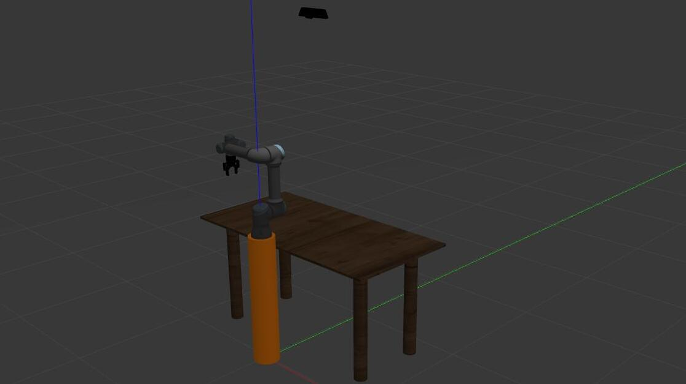

# RegoloBot

RegoloBot is a project that utilizes a [UR5 robot](https://www.universal-robots.com/it/blog/ur5-un-robot-compatto-dalle-applicazioni-infinite/) to replicate numbers and operations using math sticks (regoli in italian). This project has been developed using the ROS (Robot Operating System) framework and MoveIt library for robot control.

## Requirements
- `Ros Noetic` :  http://wiki.ros.org/noetic/Installation  
- `Gazebo`:  https://classic.gazebosim.org/tutorials?tut=ros_installing&cat=connect_ros
- `Moveit` : https://moveit.ros.org/

## Setup
- Clone this repo: 
```bash
git clone https://github.com/kodai2199/regolobot.git
```

- Installation of the UR5 robot. You can clone the official UR5 robot repository by running the following command:
```bash
git clone https://github.com/ros-industrial/universal_robot -b noetic-devel
```

## Usage
Inside the catkin workspace, run the following command to start the simulation:
```bash
./src/rapid_start.sh
```

## Description

### World

The environment that we created on gazebo in the file [regolobot.world](regolobot/regolobot.world) simply consists in a table, that rapresent the working area, and a pedestal with the UR5 on it. We also added a kinect camera for vision purposes.



### Math sticks

Math sticks are an educational tool typically used in the early years of primary school with pedagocial purposes.
There are 10 of them and every color is associated with a different lenght:  
  
We created them using Blender and we converted them in sdf files to integrate them in Gazebo environment. They are saved in the [models](regolobot/models) directory.

### Control the simulation

Launching the command:

```bash
rosrun regolobot simulation_controller.py
```
it is possible to spawn the desired number of math sticks on the table.


### Vision

The vision system we set up, utilizes the Gazbos's [kinect camera](regolobot/models/kinect) to recognize the math sticks on the table. We trained the neural network with YOLO architecture, using 5000 images, to retrieve the type and bounding box of math sticks, using [this](https://docs.ultralytics.com/datasets/obb/#yolo-obb-format) convention:  

`class_index, x1, y1, x2, y2, x3, y3, x4, y4`

The classes goes from MS01 to MS10 and rapresent the math stick type (therefore color and lenght), while the coordinates are the 4 corners of the bounding box.


### Core algorithm + pick and place task

